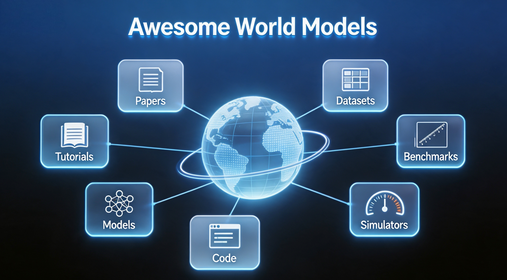

# 🎥 Awesome World Models

  

  

> 一个精心策划、面向学习者的世界模型研究资源列表：包含论文、数据集、基准测试、仿真平台、代码、模型和教程，覆盖经典基础工作和前沿进展，适合研究入门和工业部署。

✅ **收录标准**
- 优先收录来自 CVPR / ICCV / ECCV / NeurIPS / ICLR / ICML / RSS / AAAI / TPAMI 等顶级会议和期刊的高质量工作
- 覆盖核心前沿方向：基于语言的世界模型、视觉/视频世界模型、3D/4D 世界建模、隐空间世界模型、对象中心世界模型、符号与神经符号世界模型、交互式世界模型、世界动作模型（WAM）、视觉-语言-动作（VLA）、基于模型的强化学习、机器人学与具身智能、自动驾驶、GUI/计算机使用智能体、科学仿真

---

## 目录
1. [综述与概述](#-综述与概述)
2. [基础论文与技术报告](#-基础论文与技术报告)
3. [核心世界模型范式](#-核心世界模型范式)
   - 3.1 [基于语言的世界模型](#31-基于语言的世界模型)
   - 3.2 [视觉/视频世界模型](#32-视觉视频世界模型)
   - 3.3 [3D 与 4D 世界模型](#33-3d-与-4d-世界模型)
   - 3.4 [隐空间世界模型](#34-隐空间世界模型)
   - 3.5 [对象中心世界模型](#35-对象中心世界模型)
   - 3.6 [符号与神经符号世界模型](#36-符号与神经符号世界模型)
4. [交互式世界模型](#-交互式世界模型)
   - 4.1 [通用交互框架](#41-通用交互框架)
   - 4.2 [游戏与开放世界探索](#42-游戏与开放世界探索)
5. [世界动作模型（WAM）与 VLA 集成](#-世界动作模型wam-与-vla-集成)
   - 5.1 [级联式 WAM](#51-级联式-wam)
   - 5.2 [联合式 WAM](#52-联合式-wam)
   - 5.3 [用于 VLA 训练与评估的世界模型](#53-用于-vla-训练与评估的世界模型)
6. [基于模型的强化学习世界模型](#-基于模型的强化学习世界模型)
   - 6.1 [经典系列](#61-经典系列)
   - 6.2 [连续控制](#62-连续控制)
   - 6.3 [离线与泛化](#63-离线与泛化)
7. [应用领域](#-应用领域)
   - 7.1 [机器人学与具身智能](#71-机器人学与具身智能)
   - 7.2 [自动驾驶](#72-自动驾驶)
   - 7.3 [GUI / 计算机使用智能体](#73-gui--计算机使用智能体)
   - 7.4 [科学发现](#74-科学发现)
   - 7.5 [社会与经济仿真](#75-社会与经济仿真)
8. [数据集与基准测试](#-数据集与基准测试)
   - 8.1 [通用世界建模](#81-通用世界建模)
   - 8.2 [物理与因果](#82-物理与因果)
   - 8.3 [领域特定基准](#83-领域特定基准)
9. [训练与推理技术](#-训练与推理技术)
   - 9.1 [记忆机制](#91-记忆机制)
   - 9.2 [后训练与测试时扩展](#92-后训练与测试时扩展)
   - 9.3 [高效与实时推理](#93-高效与实时推理)
10. [仿真平台与物理引擎](#-仿真平台与物理引擎)
11. [理论与可解释性](#-理论与可解释性)
12. [相关 Awesome 列表](#-相关-awesome-列表)
13. [关键研究挑战](#-关键研究挑战)
14. [联系方式](#-联系方式)
15. [许可证](#-许可证)

---

## 📚 综述与概述

- **A Definition and Roadmap for World Models**
  - 发表：arXiv 2026
  - 亮点：提供了世界模型的科学定义，讨论了其关键技术方面，并给出了开发有效世界模型的分阶段路线图。
  - 论文链接：[arXiv](https://export.arxiv.org/abs/2607.06401)

- **World Models: A Comprehensive Survey of Architectures, Methodologies, Reasoning Paradigms, and Applications**
  - 发表：arXiv 2026
  - 亮点：全面综述了世界模型的架构、方法、推理范式和应用；提出了沿四个维度组织的多轴分类法。
  - 论文链接：[arXiv](https://export.arxiv.org/abs/2606.00133)

- **A Comprehensive Survey on World Models for Embodied AI**
  - 发表：arXiv 2026（2026年6月25日修订）
  - 亮点：为具身 AI 中的世界模型提出了统一框架，采用三轴分类法，涵盖功能性、决策耦合 vs. 通用型、以及时间建模。
  - 论文链接：[arXiv](https://export.arxiv.org/abs/2510.16732)

- **Towards Interactive Video World Modeling: Frontiers, Challenges, Benchmarks, and Future Trends**
  - 发表：arXiv 2026
  - 亮点：系统回顾了交互式世界建模领域的最新研究趋势、技术发展、评估基准和未来方向。
  - 论文链接：[arXiv](https://export.arxiv.org/abs/2606.01164)

- **World Action Models: A Survey**
  - 发表：arXiv 2026
  - 亮点：首次系统综述世界动作模型（WAM），厘清了世界模型、视频生成模型、动作基础视频世界模型、VLA 策略和 WAM 之间的边界。
  - 论文链接：[arXiv](https://arxiv.org/abs/2606.20781)

- **From World Models to World Action Models: A Concise Tutorial for Robotics**
  - 发表：arXiv 2026
  - 亮点：将世界模型定义为动作条件预测模型，总结了四种代表性范式：想象-然后-执行、视频特征条件动作预测、联合视频-动作建模、以及辅助视频预测。
  - 论文链接：[arXiv](https://arxiv.org/abs/2607.00836)

- **World Models for Robotic Manipulation: A Survey**
  - 发表：arXiv 2026
  - 亮点：通过三个问题调查了机器人操作中的世界模型：预测何种未来表示、预测如何与动作连接、以及在机器人学习流程中何时使用。
  - 论文链接：[arXiv](https://export.arxiv.org/abs/2606.00113)

- **Reduced-Order Models: The Mother of World Models**
  - 发表：arXiv 2026
  - 亮点：认为世界模型的功能解剖在数十年前已在模型降阶和控制文献中独立发展出来。
  - 论文链接：[arXiv](https://export.arxiv.org/abs/2607.03198)

- **A Tutorial on World Models and Physical AI**
  - 发表：arXiv 2026
  - 亮点：通过共享的预测结构，为多样化的世界建模方法提供了统一的框架；将世界建模技术与物理 AI 应用（如机器人和自动驾驶）联系起来。
  - 论文链接：[arXiv](https://arxiv.org/abs/2606.12783)

- **Beyond the Autoregressive Horizon: A Comprehensive Survey of Diffusion Models, World Modelling, and State Space Models for Code**
  - 发表：arXiv 2026
  - 亮点：全面综述了代码领域的扩散模型、状态空间模型和代码世界模型（CWM）。
  - 论文链接：[arXiv](https://export.arxiv.org/abs/2606.23690)

- **From Digital Twins to World Models: Opportunities, Challenges, and Applications for Mobile Edge General Intelligence**
  - 发表：arXiv 2026
  - 亮点：系统回顾了从数字孪生到世界模型的过渡，及其在实现移动边缘通用智能中的作用。
  - 论文链接：[arXiv](https://export.arxiv.org/abs/2603.17420)

- **Safety, Security, and Cognitive Risks in World Models**
  - 发表：arXiv 2026
  - 亮点：调查了世界模型架构及其在安全关键领域的部署背景，刻画了世界模型资产清单和威胁面。
  - 论文链接：[arXiv](https://arxiv.org/abs/2604.10644)

---

## 🧠 核心世界模型范式

### 3.2 视觉/视频世界模型

- **Advancing Open-source World Models (LingBot-World)**
  - 发表：arXiv 2026
  - 亮点：LingBot-World 是一个开源的、源于视频生成的世界模拟器，在广泛的环境（包括真实场景、科学语境、卡通风格等）中保持高保真度和鲁棒动态。
  - 论文链接：[arXiv](https://arxiv.org/abs/2601.20540)

- **Infinite Worlds with Versatile Interactions (LingBot-World 2.0 / LingBot-World-Infinity)**
  - 发表：arXiv 2026
  - 亮点：LingBot-World 的高级迭代版本，具备无限交互视界、60 fps 720p 实时渲染、多样交互元素，并集成了带有“飞行员”和“导演”智能体的智能体套件。
  - 论文链接：[arXiv](https://arxiv.org/abs/2607.07534)

- **Next Forcing: Causal World Modeling with Multi-Chunk Prediction**
  - 发表：arXiv 2026
  - 亮点：用于因果世界建模的多块预测（MCP）框架，可实现更快的训练、更高的准确率和加速推理。在 RoboTwin 基准上达到 94.1/93.5%。
  - 论文链接：[arXiv](https://arxiv.org/abs/2606.11187)

- **Orca: The World is in Your Mind**
  - 发表：arXiv 2026
  - 亮点：BAAI 提出的通用世界基础模型，从多模态世界信号中学习统一的隐世界空间，并通过多模态读出接口将其暴露出来。在 125K 小时视频数据和 1.6 亿事件标注上预训练。
  - 论文链接：[arXiv](https://arxiv.org/abs/2606.30534)

- **Qwen-RobotWorld: Unifying Embodied World Modeling through Language-Conditioned Video Generation**
  - 发表：arXiv 2026
  - 亮点：一个语言条件视频世界模型，通过双流扩散 Transformer 和 860 万视频-文本的具身体验知识语料库，预测多个机器人领域的未来视觉轨迹。
  - 论文链接：[arXiv](https://arxiv.org/abs/2606.17030)

- **ABot-PhysWorld: Interactive World Foundation Model for Robotic Manipulation with Physics Alignment**
  - 发表：arXiv 2026
  - 亮点：一个 140 亿参数的扩散 Transformer 模型，可生成视觉真实、物理合理且动作可控的机器人操作视频。
  - 论文链接：[arXiv](https://arxiv.org/abs/2603.23376)

- **Nano World Models: A Minimalist Implementation of Future Video Prediction**
  - 发表：arXiv 2026
  - 亮点：一个极简的未来视频预测代码库，围绕扩散强制（diffusion forcing）设计，为生成目标、模型规模、动作条件机制和评估协议提供统一接口。
  - 论文链接：[arXiv](https://arxiv.org/abs/2605.09301)

- **A Mechanistic View on Video Generation as World Models: State and Dynamics**
  - 发表：arXiv 2026
  - 亮点：提出了以状态构建和动力学建模为中心的分类法，将状态构建分为隐式范式（上下文管理）和显式范式（隐空间压缩）。
  - 论文链接：[arXiv](https://arxiv.org/abs/2601.17067)

- **Latent Video Prediction Learns Better World Models**
  - 发表：arXiv 2026
  - 亮点：首次系统研究隐空间预测视频模型作为世界模型的鲁棒性。
  - 论文链接：[arXiv](https://arxiv.org/abs/2605.15618)

- **PhyWorld: Physics-Faithful World Model for Video Generation**
  - 发表：arXiv 2026
  - 亮点：通过两阶段后训练（流匹配微调 + DPO 物理偏好对齐）生成时间一致且物理合理的场景延续。
  - 论文链接：[arXiv](https://export.arxiv.org/abs/2605.19242)

- **Autonomous Video Generation with Counterfactual Controllability for Self-Evolving World Models**
  - 发表：arXiv 2026
  - 亮点：通过具有反事实可控性的自主视频生成，实现自演进世界模型。
  - 论文链接：[arXiv](https://arxiv.org/abs/2606.24152)

- **Directing the World: Fast Autoregressive Video Generation with Compositional Human-Camera Control**
  - 发表：arXiv 2026
  - 亮点：用于可控世界模型视频生成的快速自回归框架，具备组合式人体运动和相机轨迹控制。
  - 论文链接：[arXiv](https://arxiv.org/abs/2606.27964)

### 3.3 3D 与 4D 世界模型

- **HY-World 2.0: A Multi-Modal World Model for Reconstructing, Generating, and Simulating 3D Worlds**
  - 发表：arXiv 2026
  - 亮点：一个多模态世界模型框架，支持多种输入模态（文本提示、单视图图像、多视图图像、视频）并生成 3D 世界表示（网格 / 高斯泼溅）。
  - 论文链接：[arXiv](https://arxiv.org/pdf/2604.14268)

- **3D-Belief: Embodied Belief Inference via Generative 3D World Modeling**
  - 发表：arXiv 2026
  - 亮点：将世界建模重新定义为 3D 空间中的具身信念推理，从部分观察中推理可操作的 3D 信念并在线更新。
  - 论文链接：[arXiv](https://export.arxiv.org/abs/2605.11367)

- **InSpatio-WorldFM: An Open-Source Real-Time Generative Frame Model**
  - 发表：arXiv 2026
  - 亮点：一个开源的实时生成式框架模型，用于空间智能，在消费级 GPU 上支持交互式探索的同时保持强多视角一致性。
  - 论文链接：[arXiv](https://arxiv.org/abs/2603.11911)

- **InSpatio-World: A Real-Time 4D World Simulator via Spatiotemporal Autoregressive Modeling**
  - 发表：arXiv 2026
  - 亮点：将用户交互转换为精确的相机轨迹，并将其集成到空间推理过程中，实现高精度相机控制生成。
  - 论文链接：[arXiv](https://arxiv.org/abs/2604.05823)

- **M⁴World: A Multi-view Multimodal Driving World Model for Interactive Object Manipulation and Minute-long Streaming**
  - 发表：arXiv 2026
  - 亮点：多视角多模态生成式驾驶世界模型，合成未来环视视频流和同步激光雷达扫描，支持交互式对象操作和分钟级稳定流式生成。
  - 论文链接：[arXiv](https://arxiv.org/abs/2607.14005)

### 3.4 隐空间世界模型

- **Orca: The World is in Your Mind**
  - 发表：arXiv 2026
  - 亮点：BAAI 提出的通用世界基础模型，从多模态世界信号中学习统一的隐世界空间。Orca 通过两种互补范式学习：无意识学习（来自连续视频的密集自然状态转移）和有意识学习（通过语言描述的事件和 VQA 监督的稀疏有意义状态转移）。
  - 论文链接：[arXiv](https://arxiv.org/abs/2606.30534)

- **Looped World Models**
  - 发表：arXiv 2026
  - 亮点：首个用于世界建模的循环架构，通过参数共享的 Transformer 块迭代细化隐环境状态，相比传统方法实现了 100 倍的参数效率提升。
  - 论文链接：[arXiv](https://arxiv.org/abs/2606.18208)

- **EMERALD: Accurate and Efficient World Modeling with Masked Latent Transformers**
  - 发表：arXiv 2026
  - 亮点：一种高效的世界模型，使用空间隐状态和 MaskGIT 预测在隐空间中生成准确的轨迹。
  - 论文链接：[arXiv](https://arxiv.org/abs/2602.03153)

- **ThinkJEPA: Empowering Latent World Models with Large Vision-Language Reasoning Model**
  - 发表：arXiv 2026
  - 亮点：VLM 引导的 JEPA 风格隐空间世界建模框架，通过双时间路径结合密集帧动态建模和长时程语义指导。
  - 论文链接：[arXiv](https://arxiv.org/abs/2603.22281)

- **FF-JEPA: Long-Horizon Planning in World Models with Latent Planners**
  - 发表：arXiv 2026
  - 亮点：Forward-Forward JEPA（FF-JEPA）统一框架，桥接世界模型、前向预测和逆动力学推理，用于无需显式目标图像的目标导向行为。
  - 论文链接：[arXiv](https://arxiv.org/abs/2606.09311)

- **Kairos: A Native World Model Stack for Physical AI**
  - 发表：arXiv 2026
  - 亮点：明确将世界模型框架化为在抽象表示空间内学习具有物理意义的预测结构的系统。
  - 论文链接：[arXiv](https://arxiv.org/abs/2606.16533)

### 3.5 对象中心世界模型

- **Latent Particle World Models: Self-supervised Object-centric Stochastic Dynamics Modeling**
  - 发表：ICLR 2026 Oral
  - 亮点：自监督对象中心世界模型，可扩展到真实世界多对象数据集用于决策。
  - 论文链接：[arXiv](https://arxiv.org/abs/2603.04553)

### 3.6 符号与神经符号世界模型

- **Graph World Models: Concepts, Taxonomy, and Future Directions**
  - 发表：arXiv 2026
  - 亮点：提出了基于关系归纳偏置的分类法，将图世界模型（GWM）分为空间 RIB（拓扑抽象）、物理 RIB（动力学仿真）和逻辑 RIB（因果语义推理）。
  - 论文链接：[arXiv](https://arxiv.org/abs/2604.12345)

- **OPINE-World: Programmatic World Modeling with Ontology-error-Prioritized Interactive Exploration**
  - 发表：arXiv 2026
  - 亮点：基于本体错误优先交互探索的程序化世界建模。
  - 论文链接：[arXiv](https://arxiv.org/abs/2607.01531)

---

## 🎮 交互式世界模型

### 4.1 通用交互框架

- **Qwen-AgentWorld: Language World Models for General Agents**
  - 发表：arXiv 2026
  - 亮点：首个能够模拟涵盖 7 个领域的智能体环境的语言世界模型（Qwen-AgentWorld-35B-A3B 和 Qwen-AgentWorld-397B-A17B），通过长链式思维推理实现，利用了超过 1000 万条环境交互轨迹。
  - 论文链接：[arXiv](https://arxiv.org/abs/2606.24597)

- **LingBot-World (Advancing Open-source World Models)**
  - 发表：arXiv 2026
  - 亮点：一个开源的、源于视频生成的世界模拟器，在广泛环境中保持高保真度和鲁棒动态。
  - 论文链接：[arXiv](https://arxiv.org/abs/2601.20540)

- **LingBot-World-Infinity (Infinite Worlds with Versatile Interactions)**
  - 发表：arXiv 2026
  - 亮点：实现了无限交互视界且输出质量一致，提炼出用于 60 fps 720p 视频流的实时变体，并引入了多样的交互元素和多玩家支持。
  - 论文链接：[arXiv](https://arxiv.org/abs/2607.07534)

- **ActWorld: From Explorable to Interactive World Model via Action-Aware Memory**
  - 发表：arXiv 2026
  - 亮点：将导航为中心的生成器扩展为支持展开过程中的对象交互；构建了包含 10 万段交互视频的数据集；引入了分层动作感知记忆设计。
  - 论文链接：[arXiv](https://arxiv.org/abs/2606.17730)

- **MoWorld: A Flash World Model**
  - 发表：arXiv 2026
  - 亮点：首个基于 NPU 的实时交互式世界模型，达到 50 FPS，推理成本仅为现有世界模型的 30%-50%。
  - 论文链接：[arXiv](https://arxiv.org/abs/2607.06216)

- **WorldDirector: Building Controllable World Simulators with Persistent Dynamic Memory**
  - 发表：arXiv 2026
  - 亮点：高度可控的视频世界模型框架，显式地将语义运动编排与视觉生成解耦，通过 LLM 协调 3D 轨迹和相机运动。
  - 论文链接：[arXiv](https://arxiv.org/abs/2607.02517)

- **Stateful Worlds, Stateless Elasticity: Exact-State Serving for Interactive World Models**
  - 发表：arXiv 2026
  - 亮点：面向交互式世界模型的确切状态服务框架；WorldMove 可在同一节点上实现 18.8ms 内的实时会话迁移。
  - 论文链接：[arXiv](https://arxiv.org/abs/2607.10389)

- **From Pixels to States: Rethinking Interactive World Models as Game Engines**
  - 发表：arXiv 2026
  - 亮点：从玩家动作控制、游戏状态动力学、状态-观察持久性和实时交互生成四个维度考察交互式游戏世界建模。
  - 论文链接：[arXiv](https://arxiv.org/abs/2607.14076)

### 4.2 游戏与开放世界探索

- **What if? Emulative Simulation with World Models for Situated Reasoning (WanderDream)**
  - 发表：arXiv 2026
  - 亮点：首个为心智探索的模拟仿真设计的大规模数据集，使模型能够无需主动探索即可进行推理。
  - 论文链接：[arXiv](https://arxiv.org/abs/2607.06193)

---

## 🤖 世界动作模型（WAM）与 VLA 集成

### 5.1 级联式 WAM

- **Flash-WAM: Modality-Aware Distillation for World Action Models**
  - 发表：arXiv 2026
  - 亮点：一个模态感知的步进蒸馏框架，将 WAM 推理压缩为每个模态单步。在 RoboTwin 2.0 上，每块延迟从数秒降至 8.1 毫秒（NVIDIA L40S 上 348 倍加速）。
  - 论文链接：[arXiv](https://arxiv.org/abs/2606.05254)

### 5.2 联合式 WAM

- **Native Video-Action Pretraining for Generalizable Robot Control (LingBot-VA 2.0)**
  - 发表：arXiv 2026
  - 亮点：一个为具身从头构建的视频-动作基础模型，包含语义视觉-动作分词器、因果预训练范式、稀疏 MoE 主干，以及用于实时闭环控制的增强异步推理方案。
  - 论文链接：[arXiv](https://arxiv.org/abs/2607.08639)

- **DiM-WAM: World Action Modeling with Diverse Historical Event Memory**
  - 发表：arXiv 2026
  - 亮点：通过银行条件候选特征、新颖性感知选择和累积质量加权融合，用多样化历史事件记忆（DHEM）增强 WAM，在有限记忆中保留互补事件标记。
  - 论文链接：[arXiv](https://arxiv.org/abs/2606.27677)

- **WorldBagel: Uncovering the Power of Unified Multimodal Models for Vision-Language-Action-World Modeling**
  - 发表：arXiv 2026
  - 亮点：基于 BAGEL 构建的统一 VLAW 框架，在 LIBERO、Language Table 和 Franka 上持续优于任务特定替代方案。
  - 论文链接：[arXiv](https://arxiv.org/abs/2607.03461)

### 5.3 用于 VLA 训练与评估的世界模型

- **WEAVER: Better, Faster, Longer: An Effective World Model for Robotic Manipulation**
  - 发表：arXiv 2026
  - 亮点：使用流匹配损失训练的多视角 WM，预测未来隐状态和奖励值，在机器人操作任务上达到 SOTA。
  - 论文链接：[arXiv](https://arxiv.org/abs/2606.13672)

- **PAIWorld: A 3D-Consistent World Foundation Model for Robotic Manipulation**
  - 发表：arXiv 2026
  - 亮点：基于 DiT 架构构建的 3D 一致世界基础模型，在 AgiBot-Challenge2026 排行榜上排名第一。
  - 论文链接：[arXiv](https://arxiv.org/abs/2606.18375)

- **WAM-RL: World-Action Model Reinforcement Learning with Reconstruction Rewards and Online Video SFT**
  - 发表：arXiv 2026
  - 亮点：首次将强化学习引入世界-动作范式，通过在线环境交互联合优化世界模型和动作模型。
  - 论文链接：[arXiv](https://arxiv.org/abs/2606.17906)

- **Reinforcing VLAs in Task-Agnostic World Models (RAW-Dream)**
  - 发表：arXiv 2026
  - 亮点：一种全新范式，将世界模型学习与下游任务依赖完全解耦。
  - 论文链接：[arXiv](https://arxiv.org/abs/2605.12334)

- **RoboDream: Compositional World Models for Scalable Robot Data Synthesis**
  - 发表：arXiv 2026
  - 亮点：一个可泛化的具身中心世界模型，通过合成带有新物体、新场景和新视角的逼真演示，实现可扩展的数据生成。
  - 论文链接：[arXiv](https://arxiv.org/abs/2606.02577)

- **Hi-WM: Human-in-the-World-Model for Scalable Robot Post-Training**
  - 发表：arXiv 2026
  - 亮点：一个后训练框架，使用学习到的世界模型作为可重用的校正基底，用于面向失败目标的策略改进。在真实世界中平均提升 37.9 个百分点的成功率。
  - 论文链接：[arXiv](https://arxiv.org/abs/2604.21741)

---

## 🧪 基于模型的强化学习世界模型

### 6.2 连续控制

- **Scaling World-Model Reinforcement Learning Through Diffusion Policy Optimization**
  - 发表：arXiv 2026
  - 亮点：通过扩散策略表示统一搜索和策略优化，释放世界模型在可扩展策略学习中的潜力。
  - 论文链接：[arXiv](https://arxiv.org/abs/2605.26282)

- **JEDI: Joint Embedding Diffusion World Model for Online Model-Based Reinforcement Learning**
  - 发表：arXiv 2026
  - 亮点：用于在线基于模型的强化学习的联合嵌入扩散世界模型。
  - 论文链接：[arXiv](https://arxiv.org/abs/2605.16034)

- **ACID: Action Consistency via Inverse Dynamics for Planning with World Models**
  - 发表：arXiv 2026
  - 亮点：通过逆动力学实现动作一致性，用于世界模型规划。
  - 论文链接：[arXiv](https://arxiv.org/abs/2607.01489)

### 6.3 离线与泛化

- **CoMap: Co-Evolving World Models and Agent Policies for LLM Agents**
  - 发表：arXiv 2026
  - 亮点：一种通过闭环交互共同进化文本世界模型和智能体策略的新颖框架。在每个决策步骤，世界模型为候选动作预测未来状态反馈。
  - 论文链接：[arXiv](https://arxiv.org/abs/2606.01695)

- **Policy and World Modeling Co-Training for Language Agents (PaW)**
  - 发表：arXiv 2026
  - 亮点：一种策略与世界模型协同训练框架，在 RL 过程中向同一策略添加辅助 WM 监督，而不改变推理范式。
  - 论文链接：[arXiv](https://arxiv.org/abs/2606.02388)

- **Dreaming of Others: Latent Teammate Modeling in World Models for Multi-Agent RL**
  - 发表：arXiv 2026
  - 亮点：将队友视为智能体世界模型中的结构化可学习组件，使世界模型不仅作为环境动态的预测器，也作为社会行为的模拟器。
  - 论文链接：[arXiv](https://arxiv.org/abs/2606.01694)

---

## 🎯 应用领域

### 7.1 机器人学与具身智能

- **Qwen-RobotWorld: Unifying Embodied World Modeling through Language-Conditioned Video Generation**
  - 发表：arXiv 2026
  - 亮点：一个用于具身智能的语言条件视频世界模型，可预测机器人操作、自动驾驶、室内导航和人到机器人迁移等领域的物理接地未来视觉轨迹。
  - 论文链接：[arXiv](https://arxiv.org/abs/2606.17030)

- **PAIWorld: A 3D-Consistent World Foundation Model for Robotic Manipulation**
  - 发表：arXiv 2026
  - 亮点：基于 DiT 的世界基础模型，在机器人操作基准上达到 SOTA 的多视角 3D 一致性。
  - 论文链接：[arXiv](https://arxiv.org/abs/2606.18375)

- **ABot-PhysWorld: Interactive World Foundation Model for Robotic Manipulation with Physics Alignment**
  - 发表：arXiv 2026
  - 亮点：一个 140 亿参数的扩散 Transformer 模型，可生成视觉真实、物理合理且动作可控的视频。
  - 论文链接：[arXiv](https://arxiv.org/abs/2603.23376)

- **ContactWorld: What Matters in Vision-Tactile World Models for Contact-Rich Manipulation**
  - 发表：arXiv 2026
  - 亮点：一个基准测试和系统的实证研究，涵盖 12 项接触丰富的操作任务（包括插入、拆卸、拧紧和探索性交互）的视觉-触觉世界模型。
  - 论文链接：[arXiv](https://arxiv.org/abs/2606.13877)

- **Hi-WM: Human-in-the-World-Model for Scalable Robot Post-Training**
  - 发表：arXiv 2026
  - 亮点：一个后训练框架，使用学习到的世界模型作为可重用的校正沙盒，用于在部署后改进预训练的机器人策略。
  - 论文链接：[arXiv](https://arxiv.org/abs/2604.21741)

- **Causally Debiased Latent Action Model for Embodied Action Conditioned World Models**
  - 发表：arXiv 2026
  - 亮点：动作条件世界模型（ACWM）旨在以具身动作为条件模拟未来观察，为机器人规划、策略评估和数据增强提供了有前景的基础。
  - 论文链接：[arXiv](https://arxiv.org/abs/2607.09461)

- **Physically Viable World Models: A Case for Query-Conditioned Embodied AI**
  - 发表：arXiv 2026
  - 亮点：认为具身 AI 的世界模型必须能够回答干预查询，即表示控制动作结果的物理结构。
  - 论文链接：[arXiv](https://arxiv.org/abs/2605.18947)

- **NavWM: A Unified Navigation World Model for Foresight-Driven Planning**
  - 发表：arXiv 2026
  - 亮点：一个统一的导航世界模型，无缝集成隐空间世界推理、多模态动作预测和可控视觉生成。
  - 论文链接：[arXiv](https://arxiv.org/abs/2606.17302)

### 7.2 自动驾驶

- **M⁴World: A Multi-view Multimodal Driving World Model for Interactive Object Manipulation and Minute-long Streaming**
  - 发表：arXiv 2026
  - 亮点：多视角多模态生成式驾驶世界模型，合成未来环视视频流和同步激光雷达扫描，同时支持交互式对象操作和稳定分钟级流式生成。
  - 论文链接：[arXiv](https://arxiv.org/abs/2607.14005)

- **AutoWorld: Scaling Multi-Agent Traffic Simulation with Self-Supervised World Models**
  - 发表：arXiv 2026
  - 亮点：一个交通仿真框架，使用从无标注 LiDAR 数据的占据表示中学习到的世界模型。
  - 论文链接：[arXiv](https://arxiv.org/abs/2603.28963)

- **Reason--Imagine--Act: Closed-Loop LLM Decision Making with World Models for Autonomous Driving**
  - 发表：arXiv 2026
  - 亮点：将大语言模型（LLM）用于自动驾驶，并在决策时通过世界模型进行显式动态验证。
  - 论文链接：[arXiv](https://arxiv.org/abs/2605.14723)

- **ReactSim-Bench: Benchmarking Reactive Behavior World Model Simulation in Autonomous Driving**
  - 发表：arXiv 2026
  - 亮点：一个用于评估自动驾驶中行为世界模型仿真反应能力的基准，包含 2,636 个测试场景。
  - 论文链接：[arXiv](https://arxiv.org/abs/2606.14058)

- **ResWorld: Temporal Residual World Model for End-to-End Autonomous Driving**
  - 发表：arXiv 2026
  - 亮点：一个时间残差世界模型，专注于动态对象建模，仅以时间残差作为输入进行精确的未来空间分布预测。
  - 论文链接：[arXiv](https://arxiv.org/abs/2602.08261)

- **Xiaomi Auto World Model: A Joint World Model Integrating Reconstruction and Generation for Autonomous Driving**
  - 发表：arXiv 2026
  - 亮点：一个统一的技术体系，解决驾驶世界模型的两大核心能力：世界表示和世界生成。
  - 论文链接：[arXiv](https://arxiv.org/abs/2605.12701)

- **CausalDrive: Real-time Causal World Models for Autonomous Driving**
  - 发表：arXiv 2026
  - 亮点：实时因果世界模型，达到 12 FPS 交互速度，仅依赖初始前视图、自车轨迹和宏文本提示。
  - 论文链接：[arXiv](https://arxiv.org/abs/2606.15341)

- **LWDrive: Layer-Wise World-Model-Guided Vision-Language Model Planning for Autonomous Driving**
  - 发表：arXiv 2026
  - 亮点：一个分层世界模型引导的 VLM 规划框架，通过分层世界模型指导来细化粗轨迹。
  - 论文链接：[arXiv](https://arxiv.org/abs/2606.29879)

- **Toward Physically Consistent Driving Video World Models under Challenging Trajectories (PhyGenesis)**
  - 发表：arXiv 2026
  - 亮点：生成具有高视觉保真度和强物理一致性的驾驶视频。
  - 论文链接：[arXiv](https://arxiv.org/abs/2603.24506)

### 7.3 GUI / 计算机使用智能体

- **WebWorld: A Large-Scale World Model for Web Agent Training**
  - 发表：arXiv 2026
  - 亮点：一个用于网络智能体训练的大规模世界模型，基于超过一百万次真实网络交互构建。作为推理时搜索的世界模型优于 GPT-5，并展现出对代码、GUI 和游戏环境的跨域泛化能力。
  - 论文链接：[arXiv](https://arxiv.org/abs/2602.14721)

- **Qwen-AgentWorld: Language World Models for General Agents**
  - 发表：arXiv 2026
  - 亮点：能够通过长链式思维推理模拟涵盖 7 个领域的智能体环境的语言世界模型，参数规模达 35B-A3B 和 397B-A17B。
  - 论文链接：[arXiv](https://arxiv.org/abs/2606.24597)

- **From Tokens to States: LLMs as a Special Case of World Models and the Continuous Path Beyond**
  - 发表：arXiv 2026
  - 亮点：一篇立场论文，探索 LLM 作为世界模型的特殊案例及其超越之路。
  - 论文链接：[arXiv](https://arxiv.org/abs/2606.28127)

- **Computer-Using World Model (CUWM)**
  - 发表：arXiv 2026
  - 亮点：一个桌面软件世界模型，根据当前状态和候选动作预测下一个 UI 状态。
  - 论文链接：[arXiv](https://arxiv.org/abs/2602.15003)

- **Code2World: A GUI World Model via Renderable Code Generation**
  - 发表：arXiv 2026
  - 亮点：通过生成可渲染代码而非直接预测像素来建模 GUI 动态。
  - 论文链接：[arXiv](https://arxiv.org/abs/2602.07131)

- **MobileDreamer: Generative Sketch World Model for GUI Agent**
  - 发表：arXiv 2026
  - 亮点：一个轻量级世界模型，预测任务相关的文本草图而非完整截图。
  - 论文链接：[arXiv](https://arxiv.org/abs/2601.04721)

---

## 📊 数据集与基准测试

### 8.1 通用世界建模

| 数据集/基准名称 | 年份 | 规模 | 核心任务 | 链接 |
|---|---|---|---|---|
| **Omni-WorldBench** | 2026 | 18 个代表性世界模型 | 面向 4D 世界模型的综合交互中心评估 | [arXiv](https://arxiv.org/abs/2603.22212) |
| **AgentWorldBench** | 2026 | 5 个前沿模型，9 个基准 | 语言世界模型的综合基准 | [arXiv](https://arxiv.org/abs/2606.24597) |
| **iWorld-Bench** | 2026 | 33 万段视频片段，4.9k 个测试样本 | 交互式世界模型评估 | [arXiv](https://arxiv.org/abs/2605.03941) |
| **WorldModelBench** | 2025 | 视频生成模型 | 世界模型评估 | [arXiv](https://arxiv.org/abs/2502.20694) |
| **WorldArena** | 2025 | 具身世界模型 | 感知与功能效用 | [arXiv](https://arxiv.org/abs/2509.12345) |
| **MemoBench** | 2026 | 360 个真实视频 | “消失-重现”世界建模评估 | [arXiv](https://arxiv.org/abs/2606.27537) |
| **Chess-World-Model** | 2026 | 1010 万盘国际象棋对局 | 精确状态跟踪基准 | [arXiv](https://arxiv.org/abs/2605.30100) |

### 8.2 物理与因果

| 数据集/基准名称 | 年份 | 规模 | 核心任务 | 链接 |
|---|---|---|---|---|
| **A Physics-Grounded Benchmark for Multi-Agent Dynamics in World Models** | 2026 | 多智能体动力学 | 物理接地多智能体动力学基准 | [arXiv](https://arxiv.org/abs/2606.28757) |
| **CausalARC** | 2026 | 因果推理任务 | 使用因果世界模型的抽象推理 | [arXiv](https://arxiv.org/abs/2603.17421) |

### 8.3 领域特定基准

#### 机器人学

| 数据集/基准名称 | 年份 | 规模 | 核心任务 | 链接 |
|---|---|---|---|---|
| **ContactWorld** | 2026 | 12 项接触丰富任务 | 用于接触丰富操作的视觉-触觉世界模型 | [arXiv](https://arxiv.org/abs/2606.13877) |
| **RoboWM-Bench** | 2026 | 机器人操作 | 视频世界模型的具身评估 | [Semantic Scholar](https://www.semanticscholar.org) |

#### 自动驾驶

| 数据集/基准名称 | 年份 | 规模 | 核心任务 | 链接 |
|---|---|---|---|---|
| **ReactSim-Bench** | 2026 | 2,636 个测试场景 | 自动驾驶中反应式行为世界模型仿真 | [arXiv](https://arxiv.org/abs/2606.14058) |
| **DrivingWorld** | 2024 | 40+ 秒视频 | 自动驾驶世界模型 | [arXiv](https://arxiv.org/abs/2412.19505) |
| **InfinityDrive** | 2024 | 分钟级 | 驾驶世界模型 | [arXiv](https://arxiv.org/abs/2412.01234) |

#### 网络/GUI 智能体

| 数据集/基准名称 | 年份 | 规模 | 核心任务 | 链接 |
|---|---|---|---|---|
| **WebWorld** | 2026 | 100 万+ 网络交互 | 用于网络智能体训练的大规模世界模型 | [arXiv](https://arxiv.org/abs/2602.14721) |

---

## ⚙️ 训练与推理技术

### 9.1 记忆机制

- **DiM-WAM: Diverse Historical Event Memory**
  - 发表：arXiv 2026
  - 亮点：使用银行条件候选特征、新颖性感知选择和累积质量加权融合，在有限记忆中保留互补事件标记，用于 WAM。
  - 论文链接：[arXiv](https://arxiv.org/abs/2606.27677)

- **Current World Models Lack a Persistent State Core**
  - 发表：arXiv 2026
  - 亮点：认为当前世界模型缺乏持久状态核心——生成器必须维护持续演化的世界状态，而不仅是在观察时渲染合理的帧。
  - 论文链接：[arXiv](https://arxiv.org/abs/2606.20545)

- **Latent Spatial Memory for Video World Models**
  - 发表：arXiv 2026
  - 亮点：将持久的 3D 场景内容直接存储为隐标记，避免重复的 RGB 渲染和重新编码。
  - 论文链接：[GitHub](https://github.com/microsoft/LatentSpatialMemory)

### 9.3 高效与实时推理

- **Flash-WAM: Modality-Aware Distillation for World Action Models**
  - 发表：arXiv 2026
  - 亮点：将 WAM 推理压缩为每个模态单步，在 RoboTwin 2.0 上实现 348 倍加速（每块从数秒降至 8.1 毫秒）。
  - 论文链接：[arXiv](https://arxiv.org/abs/2606.05254)

- **WorldCache: Accelerating World Models for Free via Heterogeneous Token Caching**
  - 发表：arXiv 2026
  - 亮点：一个针对扩散世界模型定制的缓存框架，提供高达 3.7 倍的端到端加速，同时保持 98% 的展开质量。被 ICML 2026 接收。
  - 论文链接：[arXiv](https://arxiv.org/abs/2603.06331)

- **DISK: Dynamic Inference SKipping for World Models**
  - 发表：arXiv 2026
  - 亮点：一种无需训练的、用于自回归世界模型的自适应推理方法，通过双分支控制器协调视频和自车轨迹的两个耦合扩散 Transformer。
  - 论文链接：[arXiv](https://arxiv.org/abs/2601.20436)

- **Planning in 8 Tokens: A Compact Discrete Tokenizer for Latent World Model (CompACT)**
  - 发表：arXiv 2026
  - 亮点：一种离散分词器，将每个观察压缩至仅 8 个标记。
  - 论文链接：[arXiv](https://arxiv.org/abs/2603.03182)

---

## 🔬 理论与可解释性

- **Grounding Spatial Relations in a Compact World Model: Instruction Leakage and a Goal-Free Dynamics Fix**
  - 发表：arXiv 2026
  - 亮点：识别了目标条件世界模型中的“指令泄漏”问题，并提出将目标置于动态之外作为修复方案。
  - 论文链接：[arXiv](https://arxiv.org/abs/2607.06925)

- **From Kepler to Newton: Inductive Biases Guide Learned World Models in Transformers**
  - 发表：arXiv 2026
  - 亮点：展示了归纳偏置如何引导 Transformer 学习世界模型，类似于从开普勒到牛顿的演进。
  - 论文链接：[arXiv](https://arxiv.org/abs/2602.06923)

- **Critique of World Model**
  - 发表：arXiv 2026
  - 亮点：对世界模型的批判性审视，强调世界模型本质上是模拟器而非视觉内容生成器。
  - 论文链接：[arXiv](https://arxiv.org/abs/2606.11370)

- **Research on World Models Is Not Merely Injecting World Knowledge into Specific Tasks**
  - 发表：arXiv 2026
  - 亮点：认为鲁棒的世界模型不应是能力的松散集合，而应是一个整合交互、感知、符号推理和空间表示的规范框架。
  - 论文链接：[arXiv](https://arxiv.org/abs/2602.02371)

- **GeoWorld: Geometric World Models**
  - 发表：arXiv 2026
  - 亮点：一种基于能量的预测性世界模型，通过对隐能量景观进行推理来实现多步视觉规划，而非生成像素。
  - 论文链接：[arXiv](https://arxiv.org/abs/2602.19231)

- **Why We Need World Models for AGI: Where LLMs Fail and How World Models May Outperform**
  - 发表：arXiv 2026
  - 亮点：认为世界模型在隐环境状态而非观察序列上操作，使得因果预测、模拟和规划在结构上更为自然。
  - 论文链接：[arXiv](https://arxiv.org/abs/2605.10191)

- **Agentic World Modeling: Foundations, Capabilities, Laws, and Beyond**
  - 发表：arXiv 2026
  - 亮点：连接了先前孤立的社区，规划了一条从被动下一步预测到能够模拟并最终重塑智能体所在环境的世界模型之路。
  - 论文链接：[arXiv](https://arxiv.org/abs/2604.19903)

- **Path-Measure Dynamics of Attention-Driven World Models: A Nonlocal Onsager–Machlup Approach**
  - 发表：arXiv 2026
  - 亮点：研究了注意力驱动世界模型的路径测度动态，探究注意力如何使世界模型能够基于完整历史进行条件化以实现长期记忆。
  - 论文链接：[arXiv](https://arxiv.org/abs/2607.01827)

---

## 🔑 关键研究挑战

基于新增论文的整合，额外的关键研究挑战包括：

- **持久状态核心** — 世界模型需要维护独立于观测的持久世界状态，而不是仅在观测时渲染合理的帧。
- **物理接地** — 从视觉引擎转向可操作模拟器，强调结构化 4D 接口、约束感知动态和闭环评估。
- **指令泄漏** — 识别并修复目标条件世界模型中的指令泄漏问题。
- **反事实可控性** — 自演进世界模型的核心标准是反事实可控性：即询问在给定动作下会发生什么的能力。
- **模型失配** — 在神经世界模型预测控制下，针对模型失配的自适应重规划。
- **反应能力** — 评估世界模型模拟器对偏离日志的智能体行为的响应能力。
- **模态感知蒸馏** — 开发尊重不同模态（视频 vs. 动作）不同噪声机制的蒸馏技术。
- **可验证性** — 在不能失败的系统（电力、热力、过程控制）中，部署世界模型的最大障碍是可验证性而非预测保真度。

---

## ❤️ 联系方式
如果您有新论文或数据集的建议、发现任何错误，或觉得这份资源列表对您有帮助，请通过 sun254667307@gmail.com 联系孙源良。
关于世界模型方向的研究实习机会咨询，也欢迎随时联系。

## 📄 许可证
CC0 1.0 通用许可证。完整条款请见本仓库的 `LICENSE` 文件。
